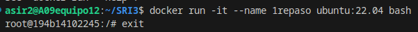
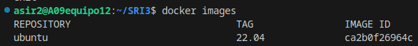
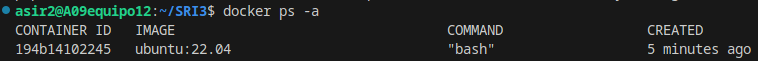
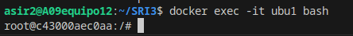
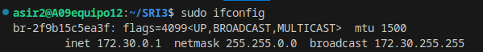
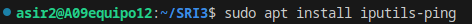
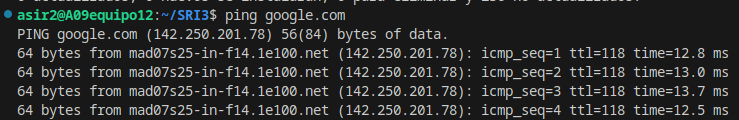
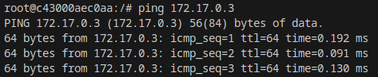
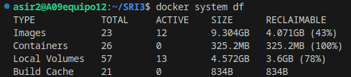
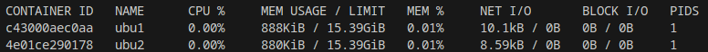

## 1. Descarga la imagen 'ubuntu y comprueba que está en tu equipo.
Descargamos el ubuntu con el comando:

    docker run -it --name 1repaso ubuntu:22.04 bash

Lo podemos comprobar con el comando:

    docker images

## 2. Crea un contenedor sin ponerle nombre. ¿está arrancado? Obtén el nombre.
Creamos el contenedor con:

    docker run ubuntu:latest bash
No arranca al no poner -it en el comando. Obtenemos el nombre con:

     docker ps -a

## 3. Crea un contenedor con el nombre 'ubu1'. ¿Como puedes acceder a él?

Podemos acceder a él con:

     docker exec -it ubu1 bash

## 4. Comprueba que ip tiene y si puedes hacer un ping a google.com

Comprobamos nuestra ip con el comando:

    ifconfig

    

Pero primero debemos instalarlo con el comando:

    apt install net-tools

    

Instalamos el ping con el comando 

    apt install iputils-ping

    

y utilizamos 

    ping google.com
para hacer ping a google.

## 5. Crea un contenedor con el nombre 'ubu2'. ¿Puedes hacer ping entre los contenedores?

Para hacer ping entre ambos contenedores, primero debemos arrancar ambos e instalar net-tools en ellos para comprobar su ip. Luego debemos instalar iputils-ping para poder realizar el ping.

Ping realizado desde "ubu1" a "ubu2"
## 6. Sal del terminal, ¿que ocurrió con el contenedor?

Los contenedores se detienen.

## 7. ¿Cuanta memoria en el disco duro ocupaste? ¿Hay alguna herramienta de docker para calcularlo?
La herramienta para calcular la memoria en disco es:

    docker system df

Ocupó 182.7 MB

## 8. ¿Cuanta RAM ocupan los contenedores? Crea cuantos contenedores necesites para calcularlo.

Lo comprobamos con:

    docker stats

Cada contenedor casi 900 kibiytes.
